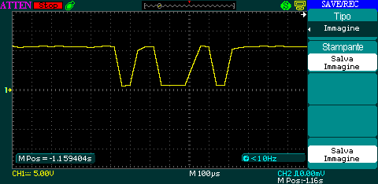
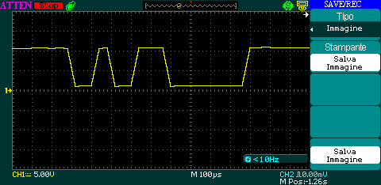

# KWP2000_arduino

This code tries to create a library for the kwp2000 protocol for arduino. 

Status PID that are running: 
 - PID_12.   ENGINE SPEED 
 - PID_13. 	VEHICLE SPEED 
 
Status SERVICE (MODE) that are running: 
 - MODE_1.   Show current data - I/M Monitors and Live Data 
 
For more information see the project wiki 
<h1></h1>
kwp2000 is a communication protocol used in some cars

Example of message exchange with KWP2000 protocol: 

the messages for SERVICE are composed as follows (Exemple: StartCommunicatioService, ReadByteByLocalIdentifier):

<h3>REQUEST</h3>
 - Format byte
 - Target byte
 - Source byte
 - SID byte 
 - Parameters
 - Checksome byte
 
 <h3>RESPONSE</h3>
 - Format byte
 - Target byte
 - Source byte
 - SID Positive Response byte 
 - key byte 1
 - key byte 2
 - Checksome byte
 <h1></h1>
 
 
 
 Exemple request and response of StartCommunicatioService 
 
 <h1>REQUEST</h1>
 - Format byte = 0xc1 
 
 - Target byte = 0x33 
 
 - Source byte = 0xf1 
 
 - SID byte = 0x81 
 
 - Parameters = NULL 
 - Checksome byte = 0x66 
 
 
 <h1>RESPONSE</h1>
 - Format byte = 0x83 
 
 - Target byte = 0xf1 
 
 - Source byte = 0x10 
 
 - SID byte = 0xc1 
 
 - key byte 1 = 0xe9 
 
 - key byte 2 = 0x8f 
 
  - Checksome byte = 0xbd 
 
 
 
 
 the messages for PID are composed as follows (Exemple: ENGINE SPEED, VEHICLE SPEED):
 
 <h3>REQUEST</h3>
 - Format byte
 - Target byte
 - Source byte
 - Mode byte 
 - Pid byte
 - Checksome byte
 
 <h3>RESPONSE</h3>
 - Format byte
 - Target byte
 - Source byte
 - SID Positive Response byte 
 - PID Code byte
 - Parameter value byte
 - Checksome byte
 <h1></h1>
 
 
 
 Exemple request and response of ENGINE SPEED

<h3>REQUEST</h3>
 - Format byte = 0xc2 
 
 - Target byte = 0x33 
 
 - Source byte = 0xf1 
 
 - Mode byte= 0x01 
 
 - Pid byte = 0x0d 
 
 - Checsome byte = 0xf4 
 
 
 <h3>RESPONSE</h3>
 - Format byte = 0x83 
 
 - Target byte = 0xf1 
 
 - Source byte = 0x10 
 
 - SID Positive Response byte = 0x41  
 
 - PID Code byte = 0x0d 
 
 - Parameter value byte = 0x00 
 
 - Checksome byte = 0xd2 
 

<h1></h1>

To interface Arduino with your car you need to create a circuit that can not burn the Arduino: transforming the 12V that supplies the K line into 5V compatible with Arduino and vice versa

Here you find an example: 

